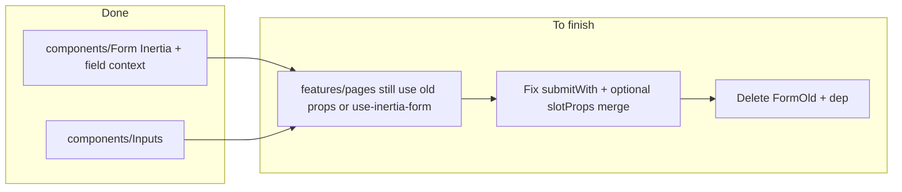

## Re-analysis: current `app/frontend/components/Form` (new Inertia form)

- **Core**: Wraps `@inertiajs/react` `Form` inside `FormFieldProvider`; forwards Inertia props (`action`, `method`, `transform`, etc.).
- **Initial state**: `initialData` is applied to the real DOM `<form>` after mount (`applyInitialData`). Optional **`rememberKey`** loads/saves draft JSON in `localStorage` and clears on successful submit (`wasSuccessful`). Subscriptions go through `subscribeFormData` in [`FormFieldContext.tsx`](app/frontend/components/Form/FormFieldContext.tsx).
- **Field convenience**: `useFormField`, `getFormData` via `formDataToObject`, per-path `subscribe`, `DynamicFields` for add/remove rows.
- **Re-exports** ([`index.ts`](app/frontend/components/Form/index.ts)): `Field` (from `@/components/Inputs/Field`), `FormConsumer`, `ResetButton` (uses Inertia slot `reset`), `Submit`, `SplitDateTimeInput` — **not** the full input suite; other inputs come from `@/components/Inputs`.
- **`submitWith`**: [`Form.tsx` lines 136–155](app/frontend/components/Form/Form.tsx) still only runs the intercept when `submitWith && onBefore?.(visit)` is truthy, and it passes **`createInitialSyntheticSlotProps()`** as the base in `runSubmitWithIntercept` — so custom submits do not merge the **live** Inertia `FormComponentSlotProps` (unlike a fully polished intercept).

## Re-analysis: `app/frontend/components/FormOld` (legacy)

- Wraps `use-inertia-form` with `data`, `to`, `onSubmit` / `submitWith` context `({ data, setError })` — see [`FormOld/Form.tsx`](app/frontend/components/FormOld/Form.tsx). Entire tree of old inputs/helpers remains alongside it.
- Grep shows **no imports** of the string `FormOld` in `app/frontend` — the folder is effectively **orphaned** until deleted after migration (still reference via mental model: “replace any remaining `use-inertia-form` usage that matched FormOld’s behavior”).

## Migration state on this branch (observed)

- **Already aligned**: e.g. [`app/frontend/features/Employees/Form/index.tsx`](app/frontend/features/Employees/Form/index.tsx) uses `action`, `method`, `initialData`; inputs use `@/components/Inputs` and `useFormField` / `Submit` from `@/components/Form`.
- **Still on old contract** (incompatible with new `FormProps`): e.g. [`app/frontend/features/Households/Form.tsx`](app/frontend/features/Households/Form.tsx) still passes `model`, `data`, and types from `use-inertia-form` — these files must be converted to `action` + `initialData` and updated field `name` attributes.
- **Shared utilities still on `use-inertia-form`**: e.g. [`app/frontend/components/Button/ModalFormButton.tsx`](app/frontend/components/Button/ModalFormButton.tsx) — should move to `submitWith` (or a small wrapper around the new `Form` slot API) and drop `UseFormProps`.

## Plan of action (no further rename: `Form` is the canonical component)

### Phase 1 — Inventory (accurate for `form` branch)

- Grep `app/frontend` for: `use-inertia-form`, `model=`, `data=`, `to=`, `UseFormProps`, `from "@/components/FormOld`, and any imports from `FormOld/Inputs`.
- Classify each form:
  - **A — Standard Inertia**: `action`/`method`/`initialData` + children; may use `useFormField` / `FormConsumer` / `rememberKey`.
  - **B — Custom submit**: axios or non-Inertia; needs `submitWith` (after hardening) or equivalent.
  - **C — Dynamic arrays**: `DynamicFields` + explicit `name` paths.

### Phase 2 — Harden new `Form` (small, targeted)

- **Unconditional `submitWith`**: when `submitWith` is set, intercept in `onBefore` (or a dedicated Inertia hook point) without requiring the user’s `onBefore` to return `true` first.
- **Optional**: merge **current** slot props from the latest `setSlotProps` (or the visit’s form helper) into `base` in [`customSubmit.ts`](app/frontend/components/Form/customSubmit.ts) so `setError`/`getData` during custom submit are not all NOOPs from the synthetic object.
- **Document** for migration: for custom submits, `normalizeSubmitError` and slot `errors` behavior.

### Phase 3 — Migrate remaining call sites

- Replace every legacy `Form` usage with:
  - `action={…}` (was `to` in many Inertia/axios examples — align with server routes and Inertia expectations),
  - `method=…`,
  - `initialData={…}` (was `data=…`),
  - **explicit** input `name` keys (e.g. `household[foo]` or `household.foo` — match what the backend already expects; same as the flattening in `applyInitialData`).
- Remove `model` everywhere (user choice: full paths, no scoping prop).
- Replace `onSubmit`/`UseFormProps` with:
  - Inertia’s slot-driven patterns where possible, or
  - `submitWith` for axios, wiring errors through `setSlotProps` / `useSlotProps` after Phase 2 hardening.
- For components that only needed “watch the form” — prefer **`FormConsumer` + `subscribeFormData`** over old `useForm` effects where applicable.

### Phase 4 — Delete legacy tree and dependency

- Delete **entire** [`app/frontend/components/FormOld/`](app/frontend/components/FormOld/) (including old `Inputs`, `FieldsFor`, `DynamicInputs`, etc.) once no code imports from it and `use-inertia-form` is unused.
- Remove `use-inertia-form` from `package.json` if nothing else requires it.
- Update [`app/frontend/lib/forms.ts`](app/frontend/lib/forms.ts) and any tests still importing the old package.

### Phase 5 — Verify

- Typecheck and run frontend test suite, especially form-related tests under `app/frontend/tests/`.
- Manual smoke: one **standard** page, one **`rememberKey`** flow, one **`DynamicFields`** form, one **custom `submitWith`** (e.g. modal create).

## Notes (correcting the previous plan)

- There is **no** `Form3` folder to rename; the rename already happened. End state = **one** `app/frontend/components/Form`, **zero** `FormOld`.
- The new `Form` **does** re-export a small set of helpers (`Field`, `FormConsumer`, `ResetButton`, `Submit`, `SplitDateTimeInput`); bulk inputs remain **`@/components/Inputs`**.
