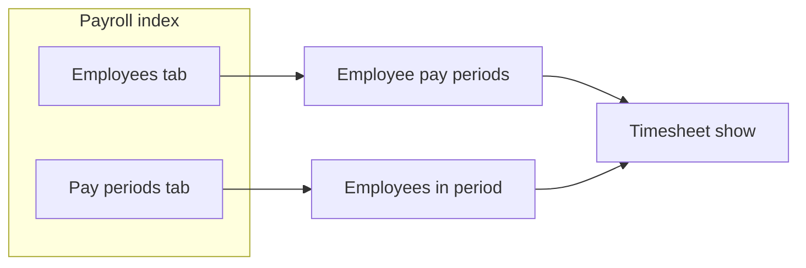

# Payroll workflow redesign

## Current state

- **Routes:** [config/routes.rb](config/routes.rb) — `resources :timesheets, path: "payroll"` so `/payroll` = timesheets index, `/payroll/:id` = timesheet show.
- **Controller:** [app/controllers/timesheets_controller.rb](app/controllers/timesheets_controller.rb) — standard CRUD; index authorizes and paginates timesheets (no employee-first flow).
- **Policy:** [app/policies/timesheet_policy.rb](app/policies/timesheet_policy.rb) — Scope: admin sees all; Employee with index role sees all, else own; Client/else none. No “facilitator sees managed_employees” yet.
- **Frontend:** [app/frontend/pages/Timesheets/Index/index.tsx](app/frontend/pages/Timesheets/Index/index.tsx) — single page; [TimesheetList](app/frontend/pages/Timesheets/Index/TimesheetList.tsx) uses **mock data**.
- **Models:** [Employee](app/models/employee.rb) has `managed_employees` via `managed_employees_managers`; [Employee::EmployeesManager](app/models/employee/employees_manager.rb) has scope `.current` for active management. [Payroll::Period](app/services/payroll/period.rb) provides `period_dates`, `previous_period_dates`, `next_period_dates` for enumerating periods.

## Target behavior

1. **Payroll index (`/payroll`)**

- **Tab 1 – Employees (default):** List of employees.  
  - **Rolify roles:** `admin` and `super_admin` are special (see all employees). All other access is determined by **group membership and/or JobTitle** via the existing permission system (`user.permission?`, Permission::Resolver).  
  - “See all employees” vs “see only managed”: use a permission (e.g. index on a payroll/employee scope) or role; facilitators (managers) see only `current_user.person.employee.managed_employees` (with `.current` on the join). No hardcoded job title slugs (e.g. “director”); use roles/permissions.
- **Tab 2 – Pay periods:** List of **past pay periods that already have timesheets** — i.e. from the DB only: `Timesheet.select(:pay_period_start, :pay_period_end).distinct.order(pay_period_start: :desc)`. No use of current `Setting.payroll_period_type` to generate period keys; mixed schemes (e.g. org switched from semi-monthly to bi-weekly) are handled because each period is just (start, end) as stored.  
  - Each row: period label from those dates, link to “employees in this period” using query params (e.g. `?pay_period_start=...&pay_period_end=...`).

1. **Employee pay periods (`/payroll/employees/:employee_id`)**

- **First row:** current (unapproved) pay period — **derived** from `Payroll::Period.period_dates(Date.current)`; no Timesheet record yet. Link goes to a **draft/current-period view** (derived hours only).
- **Remaining rows:** approved timesheets for that employee, ordered by `pay_period_start` desc. Each links to `/payroll/:timesheet_id`.
- Timesheets exist only for **approved** periods; the current period is never stored until approval.

1. **Employees in period (`/payroll/periods?...`)**

- Period is identified by **stored** `pay_period_start` and `pay_period_end` only (from existing timesheets). No `period_key` derived from current org settings — so when periodicity changes (e.g. semi-monthly → bi-weekly), past periods remain findable by their stored dates.
- URL: use query params, e.g. `GET /payroll/periods?pay_period_start=2024-03-01&pay_period_end=2024-03-15`, so the period is always the exact (start, end) pair from the DB. No encoding of “scheme” or current Setting.
- List employees that have a **timesheet** for that (start, end). Each row links to `/payroll/:timesheet_id`.

1. **Existing timesheet show/edit**

- Unchanged for **approved** timesheets: `/payroll/:id` (show), `/payroll/:id/edit` (edit).
- **Current (unapproved) period:** a separate view/route that derives hours for the current period (e.g. from shifts) and shows a “draft” for approval. On approve, create the Timesheet record (snapshot) and redirect to the new timesheet show.

## Implementation plan

### 1. Routes

- Keep `resources :timesheets, path: "payroll"` for show/edit/update (and new/destroy if still used).
- Add nested/custom routes under payroll:
  - `get "payroll/employees/:employee_id", to: "payroll#employee_periods", as: :payroll_employee_periods`
  - `get "payroll/periods", to: "payroll#period_employees", as: :payroll_period_employees` (period via `params[:pay_period_start]`, `params[:pay_period_end]`).
- Add route for **current (unapproved) period** view, e.g. `get "payroll/employees/:employee_id/current_period", to: "payroll#current_period"` or similar — serves the derived draft view; no Timesheet record.
- **Option A:** Add a dedicated `PayrollController` with `index`, `employee_periods`, `period_employees`, and keep `TimesheetsController` for timesheet CRUD (recommended: clear separation).  
- **Option B:** Add these actions to `TimesheetsController` and use a scope like `scope path: "payroll"` so `/payroll` is the new index.

Recommendation: **Option A** — new `PayrollController` for index + employee-periods + period-employees; existing `TimesheetsController` remains under the same `path: "payroll"` for `/payroll/:id`, `/payroll/:id/edit`, etc. Route order: declare payroll resource/custom routes first so `/payroll` is the new index; then `resources :timesheets, path: "payroll"` with `only: [:show, :edit, :update]` (and optionally new/create/destroy) so that `:id` doesn’t catch “employees” or “periods”.

Concretely: a **namespace or scope** so that:

- `GET /payroll` → PayrollController#index
- `GET /payroll/employees/:employee_id` → PayrollController#employee_periods
- `GET /payroll/employees/:employee_id/current_period` → PayrollController#current_period (derived draft; no Timesheet)
- `GET /payroll/periods?pay_period_start=&pay_period_end=` → PayrollController#period_employees
- `GET /payroll/new`, `POST /payroll`, `GET /payroll/:id`, `GET /payroll/:id/edit`, `PATCH /payroll/:id`, etc. → TimesheetsController (approved timesheets only; create happens on approve)

Requires a route design that avoids “employees” and “periods” being interpreted as timesheet IDs (e.g. put them before the resource in the same path prefix).

### 2. PayrollController (new)

- **Index:**  
  - **Employees tab:** Use **Rolify** for special roles: `user.has_role?(:admin)` or `user.has_role?(:super_admin)` → all employees (via policy scope). Everyone else: use existing **permission system** (group membership and/or JobTitle via `user.permission?` or policy scope); facilitators see only `current_user.person.employee.managed_employees.current` (join with `.current`). No hardcoded job title slugs.  
  - **Pay Periods tab:** Only periods that **already have timesheets** in the DB: `Timesheet` (policy-scoped). Select distinct `(pay_period_start, pay_period_end)`, order by `pay_period_start` desc. Build links with query params: `payroll_period_employees_path(pay_period_start: start, pay_period_end: end)`.  
  - Render “Payroll/Index” with `employees`, `pay_periods` (array of { start, end, label }).
- **Employee periods:**  
  - Load employee; authorize via policy (managed_employees for facilitators, or permission for “see all”).  
  - **Current period (first row):** Derive from `Payroll::Period.period_dates(Date.current)`; no Timesheet. Pass as `current_period: { pay_period_start, pay_period_end, label }` and a link to the **current-period (draft) view**.  
  - **Past periods:** Timesheets for this employee, ordered by `pay_period_start` desc.  
  - Render “Payroll/EmployeePeriods” with `employee`, `current_period` (derived), `timesheets` (approved only).
- **Current period (draft) view:**  
  - No Timesheet record. Derive hours for the given employee and current period (e.g. from shifts via existing or new service). Render “Payroll/CurrentPeriod” (or similar) with derived data; “Approve” action creates the Timesheet snapshot and redirects to `/payroll/:id`.
- **Period employees:**  
  - Read `params[:pay_period_start]` and `params[:pay_period_end]` (required).  
  - Load timesheets where `(pay_period_start, pay_period_end) = (params[:pay_period_start], params[:pay_period_end])`; apply policy scope; collect employee + timesheet_id.  
  - Render “Payroll/PeriodEmployees” with `period` (start, end, label) and list of { employee, timesheet_id }.

### 3. Policies and scoping (Rolify + permission system)

- **Special roles:** Treat `admin` and `super_admin` (Rolify) as bypass for payroll visibility (see all employees, all timesheets). Use `user.has_role?(:admin)` and `user.has_role?(:super_admin)`.
- **All other roles:** Determined by **group membership and/or JobTitle** via the existing permission system (`user.permission?`, [Permission::Resolver](app/services/permission/resolver.rb)). Do not hardcode job title slugs (e.g. “director”, “facilitator”); use permissions/roles assigned to groups or job titles.
- **Employees list on payroll:** Policy (or payroll-specific scope): admin/super_admin → all; else scope by permission; facilitators (users who have managed_employees) see only `managed_employees.current`. Align with `EmployeePolicy::Scope` if it already encodes “see all” via permission; otherwise add a payroll-scoped employee list that uses the same rules.
- **Timesheet policy:** Scope and show?/edit? must allow facilitators to see/edit timesheets for `record.employee` in `user.person.employee.managed_employees.current`. Use Rolify for admin/super_admin; for others use permission (e.g. index/show on Timesheet) plus “own or managed” logic.

### 4. Serializers and props

- **Payroll index:** Employees: use existing employees index/minimal serializer. Pay periods: array of { `pay_period_start`, `pay_period_end`, `label` } (no period_key; link URL uses query params).
- **Employee periods:** Employee (minimal) + `current_period` (derived: start, end, label; link to draft view) + `timesheets` (approved only).
- **Current period (draft) view:** Derived data (e.g. hours from shifts); no timesheet id until approval.
- **Period employees:** Period (start, end, label) + list of { employee (minimal), timesheet_id }.

### 5. Frontend

- **Payroll/Index:** Tabs: “Employees” and “Pay periods”.  
  - Employees tab: list of employees; each row links to `/payroll/employees/:employee_id`.  
  - Pay periods tab: list of periods (each has pay_period_start, pay_period_end, label); each row links to `/payroll/periods?pay_period_start=...&pay_period_end=...`.
- **Payroll/EmployeePeriods:** “Pay periods for {employee name}”. First row: **current period** (derived), link to “View/Edit current period” → `/payroll/employees/:employee_id/current_period`. Other rows: approved timesheets, link to `/payroll/:timesheet_id`.
- **Payroll/CurrentPeriod:** Draft view for current period (derived hours). “Approve” button creates the Timesheet and redirects to `/payroll/:id`.
- **Payroll/PeriodEmployees:** “Employees for period {label}”. List of employees with link to `/payroll/:timesheet_id`.

Remove or repurpose old Timesheets/Index as main payroll entry. Keep Timesheets/Show and Edit for **approved** timesheets only.

### 6. Period identity and mixed periodicity

- **No period_key from current settings.** If the org changes periodicity (e.g. semi-monthly → bi-weekly), past periods remain stored as `(pay_period_start, pay_period_end)` on existing Timesheets. Searching and listing past payrolls always use these stored dates; no dependency on `Setting.payroll_period_type`.
- **Past periods list:** Only periods that **have at least one timesheet**: `Timesheet` (policy-scoped) → distinct `(pay_period_start, pay_period_end)` ordered by start desc. No enumeration from `Payroll::Period` for the list (that would mix schemes). Links use query params: `pay_period_start`, `pay_period_end`.
- **Current period** (for the draft view) is the only place that uses `Payroll::Period.period_dates(Date.current)`; it’s for display/approval only and is never stored until approval.

### 7. Timesheet = snapshot at approval only

- **Do not create a Timesheet** when viewing the current period or when listing employee periods. A Timesheet is created **only when a facilitator (or authorized user) approves** the current period — it becomes the snapshot of approved hours for that period.
- **Current, unapproved pay period** is **derived in all views**: compute hours from shifts (or existing service) for the interval from `Payroll::Period.period_dates(Date.current)`; show as a draft; on “Approve”, create the Timesheet record and redirect to its show page.
- Existing “generate timesheet from shifts” logic (if any) is used only when **building the draft** for the current-period view, or at approval time to populate the new Timesheet; no pre-emptive creation of timesheets for the current period.
